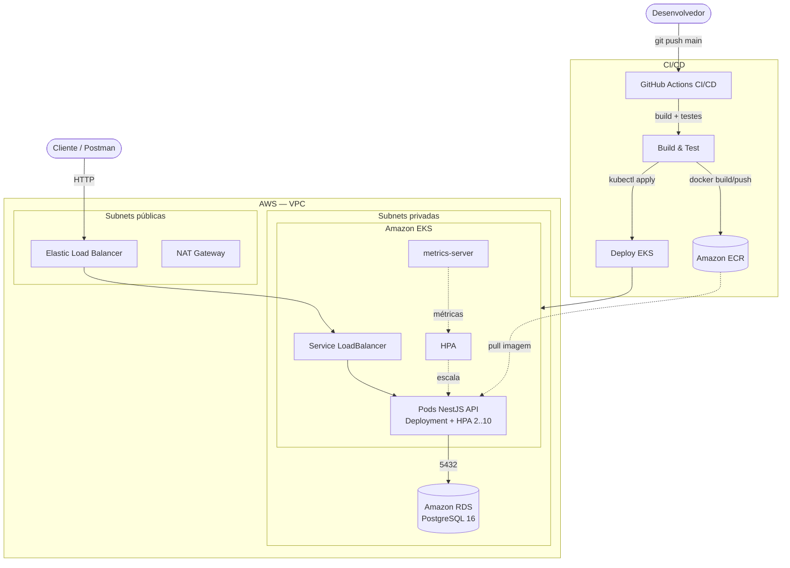

# Tech Challenge — API de Oficina Mecânica

API REST para gestão de uma oficina mecânica: clientes, veículos, peças, serviços, ordens de serviço, orçamentos e movimentações de estoque. Projeto do Tech Challenge (FIAP).

## Tecnologias

- **Node.js 24** + **TypeScript 5**
- **NestJS 11** com adapter **Fastify**
- **Prisma 7** ORM
- **PostgreSQL 16**
- **JWT** (autenticação) + **bcryptjs** (hash de senha)
- **class-validator** / **class-transformer** (validação de DTOs)
- **Swagger / OpenAPI** (documentação interativa)
- **Jest** (testes unitários e e2e)
- **Docker** / **Docker Compose**
- **SonarQube** (análise de qualidade)

## Estrutura do Projeto

**Todos os módulos de negócio seguem a Clean Architecture**: as dependências apontam sempre de fora para dentro (`infra` → `application` → `domain`), e a camada de domínio não conhece NestJS, Prisma nem HTTP. Cada módulo tem a mesma anatomia — `domain/` (entidades, enums e erros), `application/` (casos de uso, portas e mappers) e `infra/` (controllers, DTOs e adaptadores de persistência).

```
src/
├── usuarios/                        # ✅ Refatorado para Clean Architecture (módulo de referência)
│   ├── domain/                      # Camada mais interna — zero dependências externas
│   │   ├── entities/
│   │   │   └── usuario.entity.ts    # Entidade rica: valida e normaliza nome, e-mail e senha
│   │   ├── errors/
│   │   │   └── usuario.errors.ts    # Erros de domínio (herdam de DomainError)
│   │   └── perfil-usuario.ts        # Enum de domínio (ADMINISTRADOR, ATENDENTE, MECANICO, ALMOXARIFE)
│   ├── application/                 # Regras da aplicação — não conhece Nest nem Prisma
│   │   ├── ports/                   # Interfaces implementadas pela infra (inversão de dependência)
│   │   │   ├── usuario.gateway.ts   # Porta de persistência
│   │   │   ├── senha-hasher.ts      # Porta de criptografia (hash / comparar)
│   │   │   └── tokens.ts            # Símbolos de injeção das portas
│   │   ├── use-cases/               # Um caso de uso por arquivo, classes puras (sem decorators)
│   │   │   ├── criar-usuario.use-case.ts
│   │   │   ├── listar-usuarios.use-case.ts
│   │   │   ├── buscar-usuario.use-case.ts
│   │   │   ├── atualizar-usuario.use-case.ts
│   │   │   ├── remover-usuario.use-case.ts
│   │   │   └── validar-credenciais.use-case.ts   # Consumido pelo módulo auth
│   │   └── mappers/
│   │       └── usuario-output.mapper.ts          # Entidade → saída da API (nunca expõe senhaHash)
│   ├── infra/                       # Adaptadores — camada mais externa
│   │   ├── http/
│   │   │   ├── controllers/         # UsuariosController (injeta os casos de uso diretamente)
│   │   │   └── dtos/                # Contrato de entrada HTTP (class-validator + Swagger)
│   │   ├── persistence/             # PrismaUsuarioGateway + mapper Prisma ↔ domínio
│   │   └── crypto/                  # BcryptSenhaHasher
│   ├── admin-seed.service.ts        # Cria o administrador inicial no bootstrap
│   └── usuarios.module.ts           # Wiring: liga as portas aos adaptadores
│
├── auth/                            # Autenticação JWT + autorização por perfil
│   ├── decorators/                  # @Public(), @Roles()
│   ├── guards/                      # JwtAuthGuard (global) e RolesGuard
│   ├── dto/                         # LoginDto
│   └── auth.service.ts              # Assina o JWT; a validação de credenciais é um caso de uso
│
├── clientes/                        # ✅ Refatorado para Clean Architecture (mesmas camadas)
│   ├── domain/
│   │   ├── entities/                # Cliente: nome, e-mail, telefone e CPF/CNPJ validados
│   │   └── errors/                  # Erros de domínio de cliente
│   ├── application/
│   │   ├── ports/                   # ClienteGateway + token de injeção
│   │   ├── use-cases/               # criar, listar, buscar, atualizar e remover cliente
│   │   └── mappers/                 # Entidade → saída da API
│   ├── infra/
│   │   ├── http/
│   │   │   ├── controllers/         # ClientesController (injeta os casos de uso)
│   │   │   └── dtos/                # Contrato de entrada HTTP
│   │   └── persistence/             # PrismaClienteGateway + mapper Prisma ↔ domínio
│   └── clientes.module.ts
│
├── veiculos/                        # ✅ Refatorado para Clean Architecture (mesmas camadas)
│   ├── domain/
│   │   ├── entities/                # Veiculo: placa (Mercosul/antiga), marca, modelo e ano validados
│   │   └── errors/                  # Erros de domínio de veículo
│   ├── application/
│   │   ├── ports/                   # VeiculoGateway + ClienteConsultaGateway (o dono precisa existir)
│   │   ├── use-cases/               # criar, listar, buscar, atualizar e remover veículo
│   │   └── mappers/                 # Entidade → saída da API
│   ├── infra/
│   │   ├── http/
│   │   │   ├── controllers/         # VeiculosController (injeta os casos de uso)
│   │   │   └── dtos/                # Contrato de entrada HTTP
│   │   └── persistence/             # PrismaVeiculoGateway + PrismaClienteConsultaGateway
│   └── veiculos.module.ts
│
├── servicos/                        # ✅ Refatorado para Clean Architecture (mesmas camadas)
│   ├── domain/
│   │   ├── entities/                # Servico: nome único, preço base, tempo estimado e ativo
│   │   └── errors/                  # Erros de domínio de serviço
│   ├── application/
│   │   ├── ports/                   # ServicoGateway + token de injeção
│   │   ├── use-cases/               # criar, listar, buscar, atualizar e remover serviço
│   │   └── mappers/                 # Entidade → saída da API
│   ├── infra/
│   │   ├── http/
│   │   │   ├── controllers/         # ServicosController (injeta os casos de uso)
│   │   │   └── dtos/                # Contrato de entrada HTTP
│   │   └── persistence/             # PrismaServicoGateway + mapper (Decimal ↔ number)
│   └── servicos.module.ts
│
├── pecas/                           # ✅ Refatorado para Clean Architecture (mesmas camadas)
│   ├── domain/
│   │   ├── entities/                # Peca: código único, preço, estoque e estoque mínimo
│   │   └── errors/                  # Erros de domínio de peça
│   ├── application/
│   │   ├── ports/                   # PecaGateway + token de injeção
│   │   ├── use-cases/               # criar, listar, buscar, atualizar e remover peça
│   │   └── mappers/                 # Entidade → saída da API
│   ├── infra/
│   │   ├── http/
│   │   │   ├── controllers/         # PecasController (injeta os casos de uso)
│   │   │   └── dtos/                # Contrato de entrada HTTP
│   │   └── persistence/             # PrismaPecaGateway + mapper (Decimal ↔ number)
│   └── pecas.module.ts
│
├── movimentacoes-estoque/           # ✅ Refatorado para Clean Architecture (mesmas camadas)
│   ├── domain/
│   │   ├── entities/                # MovimentacaoEstoque: calcula o saldo e recusa baixa sem estoque
│   │   ├── errors/                  # Erros de domínio (inclui EstoqueInsuficienteError)
│   │   └── tipo-movimentacao-estoque.ts   # Enum de domínio (ENTRADA / BAIXA)
│   ├── application/
│   │   ├── ports/                   # MovimentacaoEstoqueGateway (registro atômico) + token
│   │   ├── use-cases/               # registrar, listar e buscar movimentação
│   │   └── mappers/                 # Entidade → saída da API
│   ├── infra/
│   │   ├── http/
│   │   │   ├── controllers/         # MovimentacoesEstoqueController
│   │   │   └── dtos/                # Contrato de entrada HTTP
│   │   └── persistence/             # PrismaMovimentacaoEstoqueGateway (transação: histórico + saldo)
│   └── movimentacoes-estoque.module.ts
│
├── ordens-servico/                  # ✅ Refatorado para Clean Architecture (mesmas camadas)
│   ├── domain/
│   │   ├── entities/                # OrdemServico (máquina de estados + marcos) e itens com preço congelado
│   │   ├── errors/                  # Erros de domínio da OS
│   │   └── status-os.ts             # Enum de domínio + transições válidas
│   ├── application/
│   │   ├── ports/                   # OrdemServicoGateway + CatalogoGateway (cliente, veículo e preços)
│   │   ├── use-cases/               # criar, listar, buscar, atualizar, remover e tempo médio
│   │   └── mappers/                 # Entidade → saída da API
│   ├── infra/
│   │   ├── http/
│   │   │   ├── controllers/         # OrdensServicoController
│   │   │   └── dtos/                # Contrato de entrada HTTP
│   │   ├── notification/            # SendGrid: avisa o cliente a cada mudança de status
│   │   └── persistence/             # PrismaOrdemServicoGateway (transação: OS + itens + histórico)
│   └── ordens-servico.module.ts
│
├── orcamentos/                      # ✅ Refatorado para Clean Architecture (mesmas camadas)
│   ├── domain/
│   │   ├── entities/                # Orcamento: aprovar/rejeitar (rejeição exige motivo)
│   │   ├── errors/                  # Erros de domínio do orçamento
│   │   └── status-orcamento.ts      # Enum de domínio
│   ├── application/
│   │   ├── ports/                   # OrcamentoGateway (criação e aprovação atômicas)
│   │   ├── use-cases/               # criar, listar, buscar, atualizar (aprovar/rejeitar) e remover
│   │   └── mappers/                 # Entidade → saída da API
│   ├── infra/
│   │   ├── http/
│   │   │   ├── controllers/         # OrcamentosController
│   │   │   └── dtos/                # Contrato de entrada HTTP
│   │   └── persistence/             # PrismaOrcamentoGateway (aprovar = OS + histórico + baixa de estoque)
│   └── orcamentos.module.ts
│
├── common/                          # Blocos compartilhados entre módulos
│   ├── exceptions/                  # DomainError: base dos erros de domínio (validação, conflito, ...)
│   ├── filters/                     # DomainExceptionFilter: traduz erro de domínio em status HTTP
│   └── validators/                  # Validador de CPF/CNPJ
│
├── database/                        # PrismaService e PrismaModule
├── generated/prisma/                # Client gerado pelo Prisma (não versionar manualmente)
├── app.module.ts                    # Composição raiz: módulos, guards e filtros globais
└── main.ts                          # Bootstrap (Fastify, ValidationPipe, Swagger)
```

Fora de `src/`:

```
prisma/                              # schema.prisma e migrations
test/                                # testes end-to-end
docs/                                # material de apoio
Dockerfile · docker-compose.yml      # containerização
```

### Camadas e regra de dependência

| Camada | O que vive aqui | Pode depender de |
|---|---|---|
| `domain` | Entidades, enums e erros de negócio | Nada (nem framework, nem banco) |
| `application` | Casos de uso, portas e mappers de saída | `domain` |
| `infra` | Controllers, DTOs HTTP, gateway Prisma, hasher bcrypt | `application` e `domain` |

Os **DTOs ficam em `infra/http/dtos/`** porque são o contrato do mecanismo de entrega: carregam decorators de `class-validator` e Swagger, e só o controller os conhece. O contrato da camada de aplicação são as interfaces `...Input` declaradas junto de cada caso de uso, e o `...Output` dos mappers — esses sim independem de HTTP.

Os casos de uso dependem apenas de **interfaces** (`UsuarioGateway`, `SenhaHasher`). Quem escolhe as implementações concretas é o `usuarios.module.ts`, o que permite testá-los isoladamente com dublês — sem banco e sem subir o Nest.

Erros de domínio (`UsuarioNaoEncontradoError`, `EmailUsuarioJaExisteError`, ...) herdam das categorias de `common/exceptions` e são convertidos em respostas HTTP (404, 409, 400, 401) pelo `DomainExceptionFilter`, registrado globalmente. Assim nenhum caso de uso precisa importar exceções do NestJS.

Os testes (`*.spec.ts`) ficam ao lado do arquivo que exercitam.

## Pré-requisitos

- Node.js 24+
- Yarn 1.x
- Docker e Docker Compose (recomendado para subir o banco)

## Configuração

1. Copie o arquivo de variáveis de ambiente:

   ```bash
   cp .env.example .env
   ```

2. Edite o `.env` conforme necessário. As variáveis principais:

   | Variável | Descrição |
   |---|---|
   | `DATABASE_URL` | Connection string do PostgreSQL (Prisma) |
   | `POSTGRES_USER` / `POSTGRES_PASSWORD` / `POSTGRES_DB` / `POSTGRES_PORT` | Credenciais do container Postgres |
   | `JWT_SECRET` | Segredo usado para assinar os tokens JWT (**obrigatório alterar em produção**) |
   | `PORT` | Porta da API (padrão `3000`) |
   | `SENDGRID_API_KEY` | Chave da API do SendGrid (notificação de status da OS) |
   | `SENDGRID_FROM_EMAIL` | Remetente dos e-mails — precisa ser um *Verified Sender* no SendGrid |

   > Sem as variáveis do SendGrid a API sobe normalmente: o envio é apenas registrado como aviso no log. A notificação é *best-effort* e nunca bloqueia a atualização da OS.

## Como rodar

### Opção 1 — Tudo via Docker Compose (recomendado)

Sobe API + Postgres em containers:

```bash
docker compose up --build
```

A API ficará disponível em `http://localhost:3000` e o Postgres em `localhost:5432`.

> O container da API aplica as migrations antes de subir (`command` no `docker-compose.yml`), então não é preciso rodar nada à mão. Em produção quem migra é o Job do Kubernetes, não o container da API.

### Opção 2 — API local + Postgres em Docker

1. Suba apenas o banco:

   ```bash
   docker compose up -d postgres
   ```

2. Instale dependências e gere o client Prisma:

   ```bash
   yarn install
   yarn prisma generate
   ```

3. Aplique as migrations:

   ```bash
   yarn prisma migrate deploy
   ```

4. Rode a API em modo de desenvolvimento:

   ```bash
   yarn start:dev
   ```

## Documentação da API (Swagger)

Após subir a API, acesse:

```
http://localhost:3000/docs
```

A documentação inclui todos os endpoints, schemas e o botão **Authorize** para autenticar com Bearer Token.

## Autenticação

A API é protegida globalmente por JWT. Rotas marcadas com `@Public()` (ex.: `POST /auth/login`) não exigem token.

1. Faça login:

   ```http
   POST /auth/login
   {
     "email": "usuario@oficina.com",
     "senha": "senha123"
   }
   ```

2. Use o `access_token` retornado no header das demais requisições:

   ```
   Authorization: Bearer <token>
   ```

### Perfis e permissões

O acesso aos endpoints é controlado por `@Roles` + `RolesGuard`:

| Perfil | Acesso |
|---|---|
| `ADMINISTRADOR` | Acesso total |
| `ATENDENTE` | Clientes, veículos, ordens de serviço, orçamentos |
| `MECANICO` | Ordens de serviço |
| `ALMOXARIFE` | Peças e movimentações de estoque |

## Scripts disponíveis

| Script | Descrição |
|---|---|
| `yarn start:dev` | Inicia a API em modo watch |
| `yarn start:prod` | Executa o build de produção (`dist/main.js`) |
| `yarn build` | Compila o projeto |
| `yarn test` | Executa os testes unitários |
| `yarn test:watch` | Testes em modo watch |
| `yarn test:cov` | Testes com relatório de cobertura |
| `yarn test:e2e` | Testes end-to-end |
| `yarn lint` | ESLint com autofix |
| `yarn format` | Prettier |
| `yarn prisma migrate dev` | Cria e aplica nova migration (dev) |
| `yarn prisma migrate deploy` | Aplica migrations existentes (prod/CI) |
| `yarn prisma studio` | Abre o Prisma Studio |

## Qualidade de código (SonarQube)

```bash
yarn sonar:up      # sobe o SonarQube local
yarn sonar         # roda testes com cobertura + scanner
yarn sonar:down    # encerra o SonarQube
```

SonarQube fica em `http://localhost:9000`.

## Testes

```bash
yarn test               # unitários
yarn test:cov           # cobertura
yarn test:e2e           # end-to-end
```

Domínios críticos (`clientes`, `veiculos`, `servicos`, `ordens-servico`, `orcamentos`) seguem o padrão **Arrange / Act / Assert** com mínimo de 80% de cobertura.

## Principais endpoints

- `POST /auth/login` — autenticação
- `GET|POST|PATCH|DELETE /clientes`
- `GET|POST|PATCH|DELETE /veiculos`
- `GET|POST|PATCH|DELETE /servicos`
- `GET|POST|PATCH|DELETE /pecas`
- `POST /ordens-servico` — abre a OS com cliente, veículo, serviços e peças
- `GET /ordens-servico` — fila de trabalho (ver abaixo)
- `GET /ordens-servico/:id` — status atual e detalhes da OS
- `PATCH /ordens-servico/:id` — muda o status da OS (notifica o cliente por e-mail)
- `GET /ordens-servico/metricas/tempo-medio` — tempo médio de execução / ciclo total
- `GET|POST|PATCH|DELETE /orcamentos` — aprovar orçamento baixa estoque automaticamente
- `GET|POST /movimentacoes-estoque`
- `GET|POST|PATCH|DELETE /usuarios` (somente ADMINISTRADOR)

Consulte o Swagger (`/docs`) para a documentação completa de cada endpoint.

### Fila de ordens de serviço (`GET /ordens-servico`)

Sem filtro, a listagem devolve a **fila de trabalho**:

- **Exclusão lógica** das OS `FINALIZADA` e `ENTREGUE` — elas continuam no banco, apenas somem da fila;
- Ordenação por prioridade de status: **Em Execução > Aguardando Aprovação > Diagnóstico > Recebida**;
- Dentro de cada status, as **mais antigas primeiro**.

Informar `?status=` consulta um status específico, inclusive os encerrados (útil para auditoria e para o histórico do cliente).

### Máquina de estados da OS

As transições válidas vivem em [status-os.ts](src/ordens-servico/domain/status-os.ts) e são aplicadas pela entidade `OrdemServico.alterarStatus()`, que também carimba os marcos de tempo (`iniciadaEm`, `finalizadaEm`, `entregueEm`).

**Todos** os caminhos que movem a OS passam por ela — inclusive os disparados pelo módulo de orçamentos, que carrega a entidade dentro da própria transação. Uma transição inválida devolve `400` e desfaz a transação inteira: não fica orçamento gravado com a OS parada.

### Recusa do orçamento, renegociação e desistência

A decisão do cliente sobre o preço **não é um status da OS** — os seis status descrevem onde o carro está no processo, e a decisão comercial vive no orçamento (`APROVADO` / `REJEITADO`, com `motivoRejeicao` e `rejeitadoEm`).

- **Recusa** (`PATCH /orcamentos/:id` com `status: REJEITADO`): é uma rodada de negociação. O orçamento é rejeitado e a OS **volta para `EM_DIAGNOSTICO`**, para ser reavaliada.
- **Nova proposta**: basta um novo `POST /orcamentos` com o mesmo `ordemServicoId` — uma OS aceita vários orçamentos, e a negociação inteira fica auditável em `GET /ordens-servico/:id`. Só pode existir **uma proposta viva por vez**: criar um segundo orçamento enquanto o atual aguarda aprovação devolve `409`.
- **Desistência**: se o cliente não quer mais o serviço, a OS é encerrada **sem execução** — `EM_DIAGNOSTICO` ou `AGUARDANDO_APROVACAO` → `FINALIZADA` → `ENTREGUE`. Depois que a execução começou isso não vale mais, porque o estoque já foi consumido.

Uma OS encerrada sem execução nunca tem `iniciadaEm`, e por isso **fica fora das métricas de tempo** — uma desistência não distorce o tempo médio de atendimento da oficina.

### Notificação de status por e-mail

**Toda** mudança de status da OS avisa o cliente por e-mail, pelo **SendGrid** — inclusive as disparadas pelo módulo de orçamentos:

| Ação | Transição | Aviso |
|---|---|---|
| `PATCH /ordens-servico/:id` | qualquer transição válida | ✉️ |
| `POST /orcamentos` | → `AGUARDANDO_APROVACAO` | ✉️ |
| `PATCH /orcamentos/:id` (aprovar) | → `EM_EXECUCAO` | ✉️ |
| `PATCH /orcamentos/:id` (recusar) | → `EM_DIAGNOSTICO` | ✉️ |

O aviso só sai quando a OS **realmente muda de status**: reenviar a mesma decisão é idempotente e não gera novo e-mail.

O envio é *best-effort*: se o provedor falhar ou não estiver configurado, o erro vai para o log e a OS **não** deixa de ser atualizada — a operação já foi persistida, e um 500 por causa de e-mail seria mentir para o usuário.

A regra vive nos casos de uso, que só conhecem a porta `NotificadorDeStatusGateway`. Trocar SendGrid por SMS ou webhook é escrever outro adaptador em `ordens-servico/infra/notification/`, sem tocar em domínio nenhum. O módulo de orçamentos importa `OrdensServicoModule` e reusa a mesma porta — a dependência é de mão única (o módulo de OS não conhece orçamentos).

---

# Fase 2 — Infraestrutura, Escalabilidade e CI/CD

Esta fase evolui a aplicação para rodar em nuvem (**AWS**) com qualidade, resiliência e escalabilidade, adicionando conteinerização, orquestração com Kubernetes, infraestrutura como código (Terraform) e um pipeline de CI/CD.

## Objetivos da fase

- **Infraestrutura escalável e resiliente** com Kubernetes gerenciado (EKS) e autoescalonamento (HPA).
- **Provisionamento automatizado** de toda a infraestrutura via Terraform.
- **Deploy automatizado** por pipeline de CI/CD na branch `main`.
- **Banco gerenciado** no Amazon RDS (PostgreSQL).

## Arquitetura proposta

Componentes da aplicação, infraestrutura provisionada e fluxo de deploy:



**Fluxo de deploy:** `push` na `main` → GitHub Actions builda e testa → gera a imagem Docker e publica no ECR → roda as migrations do banco → aplica os manifestos no EKS e atualiza a imagem → o HPA escala os pods conforme CPU/memória.

**Deploy do banco:** as migrations rodam **uma vez por deploy**, num Job do Kubernetes ([k8s/migration-job.yaml](k8s/migration-job.yaml)) que usa a mesma imagem da API, e não no boot de cada pod. Duas razões: com o HPA, cada pod novo criado durante um pico repetiria o `migrate deploy` justamente no pior momento; e uma migration com defeito derrubaria todos os pods, em vez de falhar no Job e preservar a versão em execução. O Job roda **dentro do cluster** porque o RDS é privado — o runner do GitHub Actions não alcança o banco. Se o Job falhar, o `rollout` não acontece.

## Estrutura da infraestrutura

```
infra/            # Terraform (VPC, EKS, RDS, ECR, metrics-server)
k8s/              # Manifestos Kubernetes (namespace, configmap, secret, deployment, service, hpa)
.github/workflows/deploy.yml   # Pipeline CI/CD (build, testes, imagem, deploy)
Dockerfile        # Imagem de produção (multi-stage)
docker-compose.yml# Execução local (API + PostgreSQL)
```

## Serviços AWS utilizados

| Serviço | Função |
| --- | --- |
| **Amazon EKS** | Cluster Kubernetes gerenciado que executa a API NestJS. |
| **Amazon RDS (PostgreSQL 16)** | Banco de dados gerenciado, privado. |
| **Amazon ECR** | Registro das imagens Docker da aplicação. |
| **Elastic Load Balancer** | Exposição pública da API (Service `LoadBalancer`). |
| **VPC / NAT Gateway** | Rede isolada com subnets públicas e privadas. |

## Como executar

### 1. Execução local (Docker Compose)

```bash
cp .env.example .env
docker compose up --build
```

API em `http://localhost:3000` e Swagger em `http://localhost:3000/docs`.

### 2. Provisionamento da infraestrutura (Terraform)

```bash
cd infra
cp terraform.tfvars.example terraform.tfvars   # defina db_password
terraform init
terraform apply
$(terraform output -raw kubeconfig_command)     # configura o kubectl
```

Detalhes e lista de recursos em [infra/README.md](infra/README.md).

### 3. Deploy no Kubernetes (EKS)

O deploy é feito automaticamente pelo CI/CD a cada push na `main`. Para aplicar manualmente, veja [k8s/README.md](k8s/README.md).

```bash
kubectl get pods -n oficina
kubectl get svc  -n oficina    # EXTERNAL-IP do LoadBalancer
kubectl get hpa  -n oficina    # autoescalonamento
```

## Pipeline CI/CD

Definido em [.github/workflows/deploy.yml](.github/workflows/deploy.yml), executa **apenas na branch `main`**:

1. **Build & testes** — `yarn install`, `yarn lint`, `yarn build`, `yarn test:cov`.
2. **Imagem Docker** — build e push para o **ECR** (tags `sha` e `latest`).
3. **Deploy** — `aws eks update-kubeconfig`, cria/atualiza o Secret a partir dos GitHub Secrets, aplica os manifestos e aguarda o `rollout`.

### GitHub Secrets necessários

| Secret | Descrição |
| --- | --- |
| `AWS_ACCESS_KEY_ID` / `AWS_SECRET_ACCESS_KEY` | Credenciais AWS para o deploy. |
| `AWS_REGION` | Região (ex.: `us-east-1`). |
| `ECR_REPOSITORY` | URL do repositório ECR (`terraform output ecr_repository_url`). |
| `EKS_CLUSTER_NAME` | Nome do cluster (`terraform output cluster_name`). |
| `DATABASE_URL` | Connection string do RDS (`terraform output -raw database_url`). |
| `JWT_SECRET` | Segredo de assinatura do JWT. |
| `SENDGRID_API_KEY` | Chave do SendGrid (pode ficar vazio). |
| `ADMIN_SENHA` | Senha do administrador inicial. |

## Escalabilidade (HPA)

O `HorizontalPodAutoscaler` escala de **2 a 10 pods** conforme o consumo de CPU (70%) e memória (80%). O `metrics-server` (instalado via Terraform) fornece as métricas.

Para demonstrar o autoescalonamento **sem subir nada na AWS**, use o cluster local do Docker Desktop:

```bash
bash scripts/k8s-local.sh          # sobe API + Postgres + metrics-server + HPA

kubectl get hpa -n oficina -w      # em um terminal, observe as réplicas
npx autocannon -c 100 -d 120 http://localhost/health   # em outro, gere carga
```

Detalhes e o equivalente no EKS em [k8s/README.md](k8s/README.md).

## Documentação e demonstração

- **Swagger / OpenAPI:** `http://<EXTERNAL-IP>/docs` (ou `http://localhost:3000/docs` local).
- **Vídeo demonstrativo:** _adicionar link do YouTube/Vimeo aqui_.

> **Custos:** EKS, NAT Gateway e RDS geram custo enquanto ligados. Após a demonstração, rode `terraform destroy` em `infra/`.
