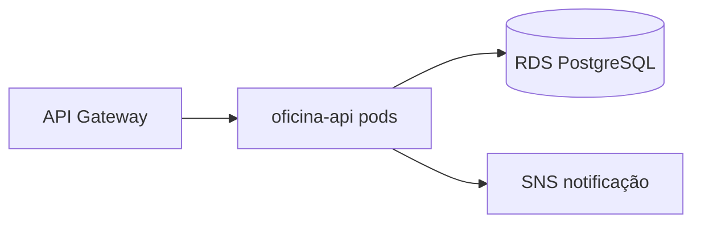

# Tech Challenge — API de Oficina Mecânica

API REST para gestão de uma oficina mecânica: clientes, veículos, peças, serviços, ordens de serviço, orçamentos e movimentações de estoque. Projeto do Tech Challenge (FIAP).

## Tecnologias

| Tecnologia | Versão |
| --- | --- |
| Node.js | 24+ |
| NestJS | 11 |
| Fastify | 11 |
| Prisma | 7 |
| PostgreSQL | 16 |
| Jest | 30 |
| Docker | multi-stage (`Dockerfile` na raiz) |
| dd-trace (Datadog) | 6 |
| SonarCloud | via CI |

## Arquitetura

Visão deste repositório (API no EKS):



Diagrama completo da nuvem: [`docs/diagramas/componentes-nuvem.md`](docs/diagramas/componentes-nuvem.md) · Visão geral: [`docs/arquitetura/visao-geral-nuvem.md`](docs/arquitetura/visao-geral-nuvem.md) · Código: [`docs/arquitetura.md`](docs/arquitetura.md)

## Pré-requisitos

- Node.js 24+
- Yarn 1.x
- Docker e Docker Compose (recomendado para subir o banco)

## Instalação e Execução

> OBS: É NECESSÁRIO CONFIGURAR O ARQUIVO .ENV

1. Clonar o repositório:

   ```bash
   git clone https://github.com/7feeh7/tech-challenge-oficina.git
   ```

2. Copiar as variáveis de ambiente:

   ```bash
   cp .env.example .env
   ```

3. Subir API + Postgres com Docker:

   ```bash
   docker compose up --build
   ```

4. Agora deve estar em execução:

- API: http://localhost:3000
- Swagger: http://localhost:3000/docs
- Postgres: localhost:5432

Variáveis de ambiente, scripts do `package.json` e execução sem Docker em [`docs/configuracao.md`](docs/configuracao.md).

## Comandos úteis

**Parar o serviço**:

```bash
docker compose down
```

## Endpoints

Contratos HTTP em [`docs/api.md`](docs/api.md), especificação em [`docs/openapi.json`](docs/openapi.json) e coleção Postman em [`docs/postman/tech-challenge-fase3.postman_collection.json`](docs/postman/tech-challenge-fase3.postman_collection.json).

Em produção, toda entrada pública passa pelo **API Gateway** (URL em SSM `api_gateway_url`). Rotas de negócio usam prefixo `/v1`; autenticação por CPF em `POST /auth/cpf`.

Todas as rotas `/v1/*` são protegidas por JWT, exceto `POST /v1/auth/login` e `/health`. Faça login e envie o token:

```bash
# Login interno
curl --location 'https://{api_gateway_url}/v1/auth/login' \
  --header 'Content-Type: application/json' \
  --data '{"email":"usuario@oficina.com","senha":"senha123"}'

# Cliente por CPF (sem /v1)
curl --location 'https://{api_gateway_url}/auth/cpf' \
  --header 'Content-Type: application/json' \
  --data '{"cpf":"529.982.247-25"}'

# Rotas protegidas
curl --location 'https://{api_gateway_url}/v1/clientes' \
  --header 'Authorization: Bearer SEU_TOKEN'
```

Detalhes em [`docs/gateway-rotas.md`](docs/gateway-rotas.md).

Perfis, permissões e fluxo de login em [`docs/autenticacao.md`](docs/autenticacao.md).

Principais rotas:

- `POST /auth/login` — autenticação
- `GET|POST|PATCH|DELETE /clientes`, `/veiculos`, `/servicos`, `/pecas`
- `POST /ordens-servico` — abre a OS com cliente, veículo, serviços e peças
- `GET /ordens-servico` — fila de trabalho
- `GET /ordens-servico/:id` — status atual e detalhes da OS
- `PATCH /ordens-servico/:id` — muda o status da OS (notifica o cliente por e-mail)
- `GET /ordens-servico/metricas/tempo-medio` — tempo médio de execução / ciclo total
- `GET|POST|PATCH|DELETE /orcamentos` — aprovar orçamento baixa estoque automaticamente
- `GET|POST /movimentacoes-estoque`
- `GET|POST|PATCH|DELETE /usuarios` (somente ADMINISTRADOR)

Fila de OS, máquina de estados, renegociação, desistência e notificação por e-mail em [`docs/regras-de-negocio.md`](docs/regras-de-negocio.md).

## Como rodar os testes

Executar toda a suite:

```bash
yarn test
```

Cobertura e end-to-end:

```bash
yarn test:cov
yarn test:e2e
```

Cobertura mínima, padrão dos testes e SonarQube em [`docs/testes-e-qualidade.md`](docs/testes-e-qualidade.md).

## Repositórios da solução (Fase 3)

| Repositório | Responsabilidade | URL |
| --- | --- | --- |
| **tech-challenge-oficina** (este) | API NestJS, Prisma, `Dockerfile`, manifests `k8s/`, docs | https://github.com/7feeh7/tech-challenge-oficina |
| tech-challenge-serverless | Functions auth CPF e notificação | https://github.com/7feeh7/tech-challenge-serverless |
| tech-challenge-infra-kubernetes | VPC, EKS, ECR, API Gateway, mensageria, Datadog | https://github.com/7feeh7/tech-challenge-infra-kubernetes |
| tech-challenge-infra-database | RDS PostgreSQL, Secrets Manager | https://github.com/7feeh7/tech-challenge-infra-database |

**Ordem de deploy:** infra-kubernetes → infra-database → serverless → **este repo** (4º).

## Infraestrutura e deploy

A aplicação roda em **EKS** com banco no **RDS**, imagem no **ECR** e autoescalonamento por **HPA**. Existe **um único ambiente provisionado**: `develop` valida automaticamente (sem tocar a AWS) e `main` implanta após merge de PR aprovado.

### Deploy ativo (produção)

| Recurso | Como obter |
| --- | --- |
| API Gateway (URL base) | SSM `/tech-challenge/producao/infra/api_gateway_url` |
| Swagger UI | `{api_gateway_url}/docs` |
| Health | `{api_gateway_url}/health` |
| Imagem ECR | SSM `ecr_repository_url` + tag = SHA do commit em `main` |

> Após a demonstração o ambiente pode ser desligado por custo. Consulte [`docs/entrega/entrega-fase3.md`](docs/entrega/entrega-fase3.md) para data de validação.

### Dockerfile

`Dockerfile` multi-stage na raiz: build NestJS + Prisma generate, runtime Alpine com usuário não-root. Migrations rodam no Job `k8s/migration-job.yaml`, não no CMD da imagem.

### Variáveis e secrets (sem valores)

| Escopo | Nomes |
| --- | --- |
| `.env` local | Ver [`.env.example`](.env.example) |
| GitHub Environment `producao` | `AWS_*`, `JWT_SECRET`, `SENDGRID_API_KEY`, `ADMIN_SENHA` |
| Runtime K8s | `DATABASE_URL` (Secret), `DD_*`, `JWT_*`, `SNS_NOTIFICACAO_TOPIC_ARN` |

Rollback automático: falha pós-migration dispara `kubectl rollout undo` — ver [`docs/ci-cd.md`](docs/ci-cd.md).

### Seed de demonstração

Dados fictícios para gravação do vídeo — **somente manual**:

```bash
./scripts/seed-demo.sh
```

Roteiro completo: [`docs/demo-fase3.md`](docs/demo-fase3.md).

- ADRs: [`docs/adrs/README.md`](docs/adrs/README.md) · RFCs: [`docs/rfcs/README.md`](docs/rfcs/README.md)
- Arquitetura Fase 3: [`docs/arquitetura/README.md`](docs/arquitetura/README.md)
- Infraestrutura e provisionamento: [`docs/infraestrutura.md`](docs/infraestrutura.md)
- Pipeline e secrets: [`docs/ci-cd.md`](docs/ci-cd.md)
- Governança de branches: [`docs/governanca-git.md`](docs/governanca-git.md)
- Manifests Kubernetes: [`k8s/README.md`](k8s/README.md)

> **Custos:** EKS, NAT Gateway e RDS geram custo enquanto ligados. Use `workflow_dispatch` → destroy nos repos de infra após a demonstração.

## Documentação

Índice completo em [`docs/README.md`](docs/README.md).

| Documento                                        | Conteúdo                                                    |
| ------------------------------------------------ | ----------------------------------------------------------- |
| [arquitetura](docs/arquitetura.md)               | Clean Architecture, estrutura de pastas e camadas           |
| [configuracao](docs/configuracao.md)             | Variáveis de ambiente, execução local e scripts             |
| [autenticacao](docs/autenticacao.md)             | Login JWT, perfis e permissões                              |
| [api](docs/api.md)                               | Contratos HTTP de todos os endpoints                        |
| [regras-de-negocio](docs/regras-de-negocio.md)   | Fila de OS, máquina de estados, orçamentos, estoque, e-mail |
| [testes-e-qualidade](docs/testes-e-qualidade.md) | Testes, cobertura e SonarQube                               |
| [arquitetura](docs/arquitetura/README.md)        | Visão Fase 3, diagramas, RFCs e ADRs                        |
| [infraestrutura](docs/infraestrutura.md)         | AWS, Terraform, Kubernetes e HPA                            |
| [banco](docs/banco/README.md)                    | Modelo relacional, ER e performance                         |
| [runbooks](docs/runbooks/README.md)              | Procedimentos operacionais                                  |
| [ci-cd](docs/ci-cd.md)                           | Pipeline do GitHub Actions e secrets                        |

**Vídeo demonstrativo:** _preencher URL após publicação (YouTube/Vimeo, ≤ 15 min)_ — também registrado em [`docs/entrega/entrega-fase3.md`](docs/entrega/entrega-fase3.md).

**Entrega Fase 3 (PDF):** [`docs/entrega/entrega-fase3.md`](docs/entrega/entrega-fase3.md) · Matriz de conformidade: [`spec/changes/009-readmes-demonstracao-e-entrega-final/matriz-conformidade.md`](spec/changes/009-readmes-demonstracao-e-entrega-final/matriz-conformidade.md)
