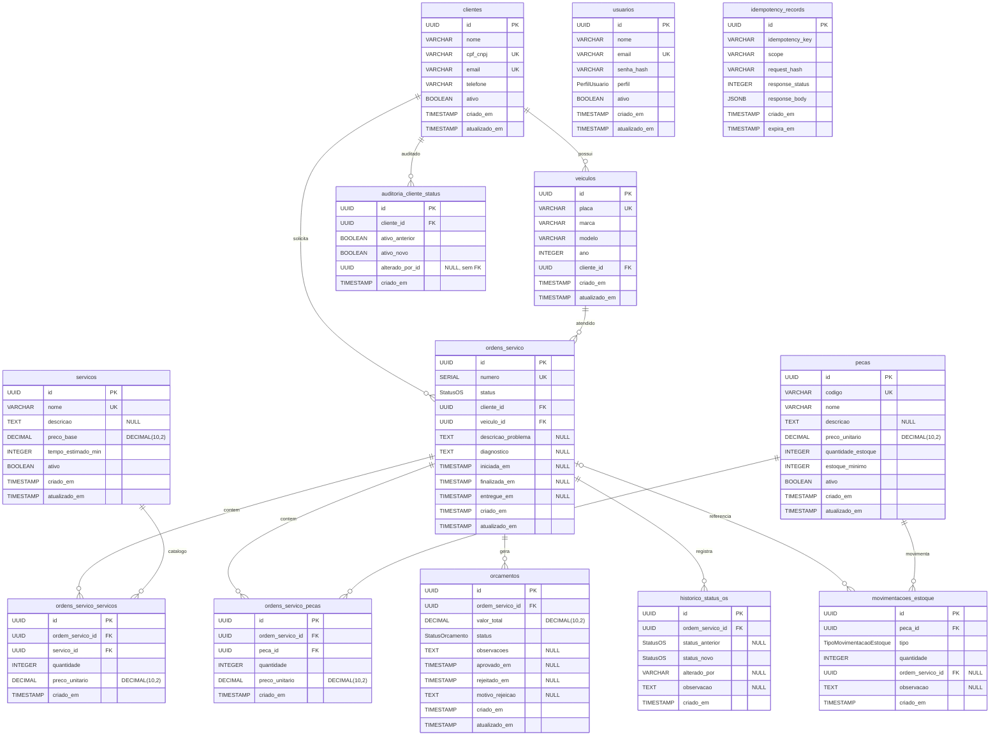

# Diagrama de Entidade-Relacionamento — Sistema de Ordens de Serviço

**SGBD:** PostgreSQL 16 (Amazon RDS, `tech-challenge-infra-database`)  
**Schema:** `tech-challenge/prisma/schema.prisma` + migrations  
**Versão:** 2026-09-14

O serviço RDS (VPC, TLS, backup, secrets) fica no repositório de infra. Tabelas, PKs, FKs, ENUMs, CHECKs e índices evoluem neste repositório via Prisma.

## DER (Mermaid)



## Tipos PostgreSQL

Prisma mapeia `String` para `TEXT`. Em PostgreSQL, `TEXT` e `VARCHAR` sem limite são equivalentes (mesmo armazenamento). O DER usa `VARCHAR` nos campos curtos de domínio e `TEXT` em textos longos.

| Tipo no DER | Tipo físico (migrations) | Uso |
| --- | --- | --- |
| `UUID` | `UUID` | PKs e FKs (`gen_random_uuid()` via Prisma `@default(uuid())`) |
| `VARCHAR` | `TEXT` | Nome, e-mail, CPF/CNPJ, placa, código, hash |
| `TEXT` | `TEXT` | Descrição, diagnóstico, observações |
| `SERIAL` | `SERIAL` (`INTEGER` + sequence) | `ordens_servico.numero` (UK) |
| `INTEGER` | `INTEGER` | Ano, quantidade, tempo, HTTP status |
| `BOOLEAN` | `BOOLEAN` | Flags `ativo` |
| `DECIMAL` | `DECIMAL(10,2)` | Preços e totais (sem ponto flutuante) |
| `TIMESTAMP` | `TIMESTAMP(3)` | Marcas temporais (precisão de milissegundo) |
| `JSONB` | `JSONB` | Corpo da resposta idempotente |
| `StatusOS` / `StatusOrcamento` / `TipoMovimentacaoEstoque` / `PerfilUsuario` | `CREATE TYPE ... AS ENUM` | Domínio fechado |

## ENUMs

```sql
PerfilUsuario            = ADMINISTRADOR | ATENDENTE | MECANICO | ALMOXARIFE
StatusOS                 = RECEBIDA | EM_DIAGNOSTICO | AGUARDANDO_APROVACAO | EM_EXECUCAO | FINALIZADA | ENTREGUE
StatusOrcamento          = AGUARDANDO_APROVACAO | APROVADO | REJEITADO
TipoMovimentacaoEstoque  = ENTRADA | BAIXA
```

## Chaves estrangeiras e `ON DELETE`

| Filho | Coluna FK | Pai | ON DELETE | Motivo |
| --- | --- | --- | --- | --- |
| `veiculos` | `cliente_id` | `clientes.id` | `RESTRICT` | Não apaga cliente com veículos |
| `auditoria_cliente_status` | `cliente_id` | `clientes.id` | `RESTRICT` | Preserva trilha de bloqueio/ativação |
| `ordens_servico` | `cliente_id` | `clientes.id` | `RESTRICT` | Não apaga cliente com OS |
| `ordens_servico` | `veiculo_id` | `veiculos.id` | `RESTRICT` | Não apaga veículo com OS |
| `ordens_servico_servicos` | `ordem_servico_id` | `ordens_servico.id` | `CASCADE` | Itens não existem sem a OS |
| `ordens_servico_servicos` | `servico_id` | `servicos.id` | `RESTRICT` | Catálogo referenciado |
| `ordens_servico_pecas` | `ordem_servico_id` | `ordens_servico.id` | `CASCADE` | Itens não existem sem a OS |
| `ordens_servico_pecas` | `peca_id` | `pecas.id` | `RESTRICT` | Catálogo referenciado |
| `orcamentos` | `ordem_servico_id` | `ordens_servico.id` | `CASCADE` | Orçamento derivado da OS |
| `historico_status_os` | `ordem_servico_id` | `ordens_servico.id` | `CASCADE` | Histórico derivado da OS |
| `movimentacoes_estoque` | `peca_id` | `pecas.id` | `RESTRICT` | Não apaga peça com movimentação |
| `movimentacoes_estoque` | `ordem_servico_id` | `ordens_servico.id` | `SET NULL` | Baixa permanece no estoque se a OS for removida |

`auditoria_cliente_status.alterado_por_id` é `UUID NULL` **sem FK** para `usuarios` (auditoria não acopla o ciclo de vida do operador).  
`historico_status_os.alterado_por` é `VARCHAR/TEXT NULL` (identificador textual, sem FK).  
`usuarios` e `idempotency_records` não participam do grafo de OS.

## Unicidades compostas (UK)

| Tabela | Constraint | Regra |
| --- | --- | --- |
| `ordens_servico_servicos` | `UNIQUE (ordem_servico_id, servico_id)` | Mesmo serviço não entra duas vezes na OS; repetir aumenta `quantidade` |
| `ordens_servico_pecas` | `UNIQUE (ordem_servico_id, peca_id)` | Idem para peça |
| `idempotency_records` | `UNIQUE (idempotency_key, scope)` | Replay seguro de escritas críticas |

Unicidades simples: `clientes.cpf_cnpj`, `clientes.email`, `veiculos.placa`, `usuarios.email`, `servicos.nome`, `pecas.codigo`, `ordens_servico.numero`.

## CHECKs de domínio

| Tabela | Constraint |
| --- | --- |
| `servicos` | `preco_base >= 0`, `tempo_estimado_min > 0` |
| `pecas` | `preco_unitario >= 0`, `quantidade_estoque >= 0`, `estoque_minimo >= 0` |
| `ordens_servico_servicos` / `ordens_servico_pecas` | `quantidade >= 1`, `preco_unitario >= 0` |
| `orcamentos` | `valor_total >= 0` |
| `movimentacoes_estoque` | `quantidade > 0` |

## Cardinalidades (resumo)

- Um **cliente** possui N **veículos** e solicita N **ordens de serviço**.
- Uma **OS** pertence a 1 cliente e 1 veículo; contém N serviços e N peças (tabelas de junção).
- Uma **OS** gera N **orçamentos** e N registros de **histórico de status**.
- Uma **movimentação de estoque** pertence a 1 peça e pode referenciar 0..1 OS (`ordem_servico_id` anulável).
- **Usuário** (equipe interna / JWT) e **idempotency_records** são entidades auxiliares, fora do agregado da OS.
