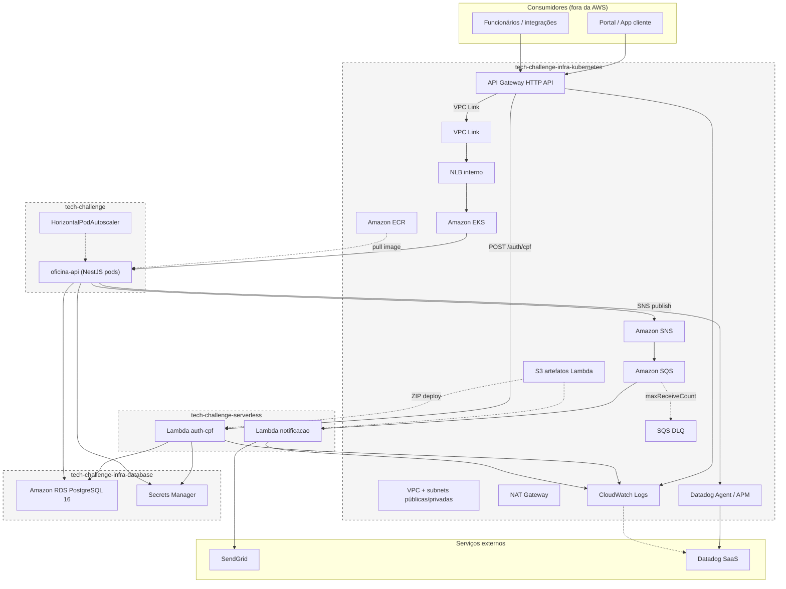

# Diagrama de componentes — nuvem completa

**Versão:** 2026-09-13
**Ambiente:** `producao` (único provisionado)

## Limites de rede

| Zona    | Componentes                       | Acesso            |
| ------- | --------------------------------- | ----------------- |
| Público | API Gateway                       | Internet → HTTPS  |
| Privado | EKS nodes, Lambda (VPC), RDS      | Sem IP público    |
| NAT     | Saída para SendGrid, Datadog, ECR | Egress controlado |

## Legenda de repositório

Caixas tracejadas agrupam recursos pelo repositório Terraform/código responsável pelo deploy daquele artefato.
