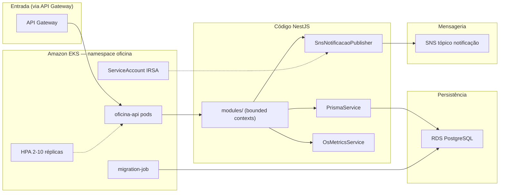

# Diagrama — repositório tech-challenge

**Versão:** 2026-09-13 (spec 008)

```mermaid
flowchart LR
    subgraph borda["Entrada (via API Gateway)"]
        GW["API Gateway"]
    end

    subgraph eks["Amazon EKS — namespace oficina"]
        POD["oficina-api pods"]
        HPA["HPA 2-10 réplicas"]
        JOB["migration-job"]
        SA["ServiceAccount IRSA"]
    end

    subgraph app["Código NestJS"]
        MOD["modules/ (bounded contexts)"]
        PRISMA["PrismaService"]
        SNSP["SnsNotificacaoPublisher"]
        MET["OsMetricsService"]
    end

    subgraph dados["Persistência"]
        RDS["RDS PostgreSQL"]
    end

    subgraph msg["Mensageria"]
        SNS["SNS tópico notificação"]
    end

    GW --> POD
    HPA -.-> POD
    POD --> MOD
    MOD --> PRISMA --> RDS
    MOD --> SNSP --> SNS
    MOD --> MET
    SA -.-> SNSP
    JOB --> RDS
```

Visão completa: [componentes-nuvem.md](componentes-nuvem.md).
