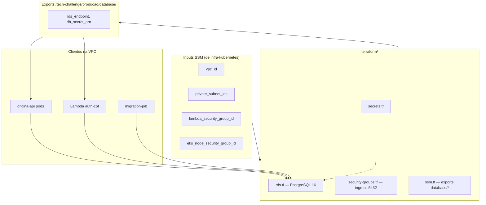

# Diagrama — repositório tech-challenge-infra-database

**Versão:** 2026-09-13

```mermaid
flowchart TB
    subgraph inputs["Inputs SSM (de infra-kubernetes)"]
        VPC["vpc_id"]
        SUB["private_subnet_ids"]
        SG_L["lambda_security_group_id"]
        SG_E["eks_node_security_group_id"]
    end

    subgraph tf["terraform/"]
        RDS["rds.tf — PostgreSQL 16"]
        SEC["secrets.tf"]
        SG["security-groups.tf — ingress 5432"]
        SSM_OUT["ssm.tf — exports database/*"]
    end

    subgraph outputs["Exports /tech-challenge/producao/database/"]
        EP["rds_endpoint, db_secret_arn"]
    end

    subgraph clients["Clientes na VPC"]
        API["oficina-api pods"]
        LA["Lambda auth-cpf"]
        MIG["migration-job"]
    end

    inputs --> tf
    tf --> outputs
    outputs --> API
    outputs --> LA
    API --> RDS
    LA --> RDS
    MIG --> RDS
    SEC -.-> RDS
```

Schema/tabelas: `tech-challenge/prisma/` (fora deste repo).
