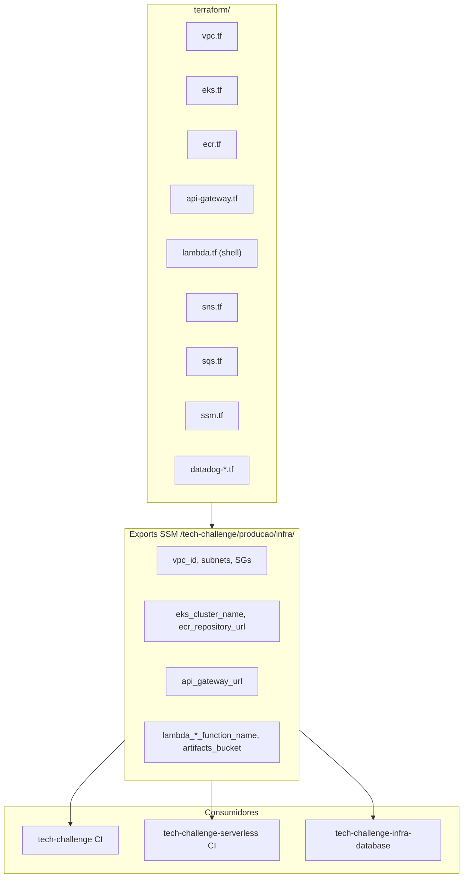

# Diagrama — repositório tech-challenge-infra-kubernetes

**Versão:** 2026-09-13

```mermaid
flowchart TB
    subgraph tf["terraform/"]
        VPC["vpc.tf"]
        EKS["eks.tf"]
        ECR["ecr.tf"]
        GW["api-gateway.tf"]
        LAM["lambda.tf (shell)"]
        SNS["sns.tf"]
        SQS["sqs.tf"]
        SSM["ssm.tf"]
        DD["datadog-*.tf"]
    end

    subgraph outputs["Exports SSM /tech-challenge/producao/infra/"]
        P1["vpc_id, subnets, SGs"]
        P2["eks_cluster_name, ecr_repository_url"]
        P3["api_gateway_url"]
        P4["lambda_*_function_name, artifacts_bucket"]
    end

    subgraph consumers["Consumidores"]
        APP["tech-challenge CI"]
        SL["tech-challenge-serverless CI"]
        DB["tech-challenge-infra-database"]
    end

    tf --> outputs
    outputs --> APP
    outputs --> SL
    outputs --> DB
```

Detalhes: [contratos-cross-repo.md](../../../tech-challenge-infra-kubernetes/docs/contratos-cross-repo.md).
