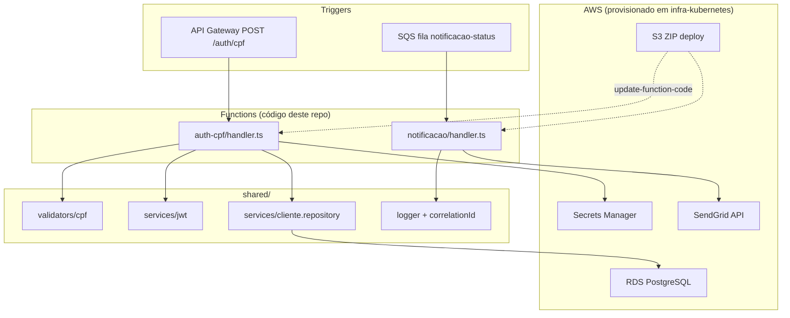

# Diagrama — repositório tech-challenge-serverless

**Versão:** 2026-09-13

Contratos: [contrato-auth-cpf.md](../../../tech-challenge-serverless/docs/contrato-auth-cpf.md), [contrato-evento-notificacao.md](../../../tech-challenge-serverless/docs/contrato-evento-notificacao.md).
