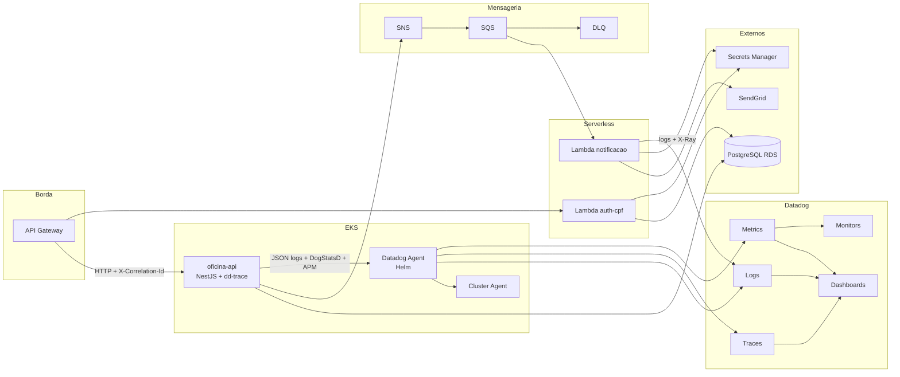

# Diagrama de Observabilidade

## Coleta

| Fonte | Coletor | Destino Datadog |
| --- | --- | --- |
| Containers API | Agent (logs, APM, runtime) | Logs, Traces, Metrics |
| Métricas K8s | Cluster Agent | Infrastructure |
| Métricas negócio | dd-trace DogStatsD | Custom Metrics |
| Lambda | CloudWatch / extensão | Logs, AWS metrics |
| Gateway | CloudWatch access logs | Logs (opcional forward) |
