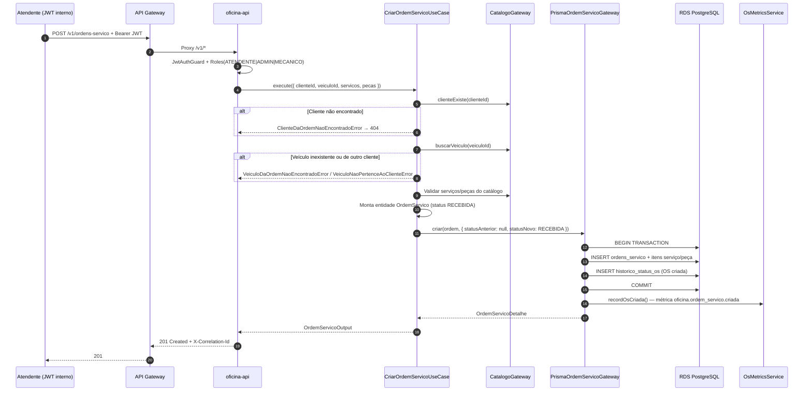

# Sequência — abertura de ordem de serviço

**Versão:** 2026-09-13
**Implementação:** `CriarOrdemServicoUseCase`, `PrismaOrdemServicoGateway.criar`, `OrdensServicoController.create`.

## Notas de implementação

- Autenticação interna via `POST /v1/auth/login` (não CPF); rota exige perfil `ATENDENTE`, `ADMINISTRADOR` ou `MECANICO`.
- Decorator `@Idempotent('ordens-servico.create')` evita duplicidade em retries.
- Notificação por e-mail ocorre apenas em **transição de status** (`PATCH`), não na abertura.
- Preços unitários são congelados nos itens da OS no momento da criação.

## Referências

- [regras-de-negocio.md](../regras-de-negocio.md)
- [api.md](../api.md) — `POST /v1/ordens-servico`
