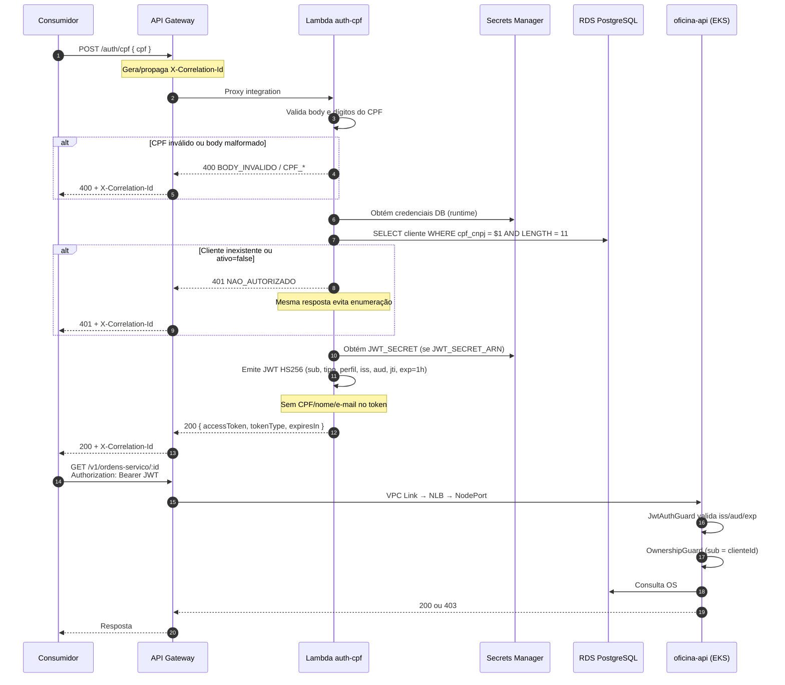

# Sequência — autenticação por CPF

**Versão:** 2026-09-13 (spec 008)  
**Implementação:** `tech-challenge-serverless/src/functions/auth-cpf/`, guards NestJS em `tech-challenge/src/modules/auth/`.

## Referências

- [contrato-auth-cpf.md](../../../tech-challenge-serverless/docs/contrato-auth-cpf.md)
- [autenticacao.md](../autenticacao.md)
- [RFC-003](../rfcs/003-autenticacao-cpf-jwt.md)
