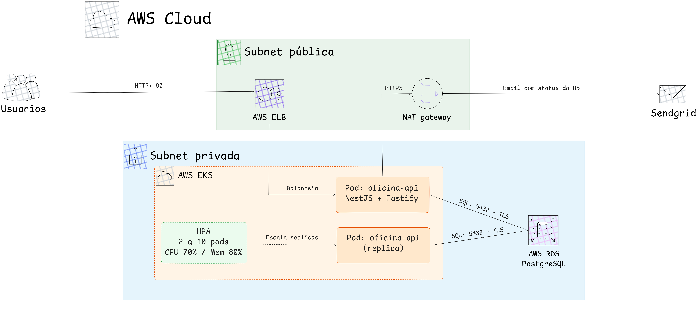

# Fase 2 — Infraestrutura, Escalabilidade e Cloud

Esta fase evolui a aplicação para rodar em nuvem (**AWS**) com qualidade, resiliência e escalabilidade, adicionando conteinerização, orquestração com Kubernetes, infraestrutura como código (Terraform) e um pipeline de CI/CD (ver [ci-cd.md](ci-cd.md)).

## Objetivos da fase

- **Infraestrutura escalável e resiliente** com Kubernetes gerenciado (EKS) e autoescalonamento (HPA).
- **Provisionamento automatizado** de toda a infraestrutura via Terraform.
- **Deploy automatizado** por pipeline de CI/CD na branch `main`.
- **Banco gerenciado** no Amazon RDS (PostgreSQL).

## Arquitetura proposta

Arquitetura do serviço em execução — entrada pelo Load Balancer, pods no EKS e a comunicação com o **Amazon RDS** e o **SendGrid**:



**Fluxo de deploy:** `push` na `main`, o GitHub Actions builda e testa, gera a imagem Docker e publica no ECR, roda as migrations do banco, aplica os manifestos no EKS e atualiza a imagem; o HPA escala os pods conforme CPU/memória.

**Conexão com o banco:** o RDS recusa conexão sem TLS (`rds.force_ssl`), e seu certificado é emitido por uma CA da Amazon que não está no trust store do Node. Por isso a aplicação conecta com TLS sem validar a cadeia, ligado pela variável `DATABASE_SSL` do ConfigMap. Localmente ela fica `false`, já que o Postgres em container não fala TLS.

**Deploy do banco:** as migrations rodam **uma vez por deploy**, num Job do Kubernetes ([k8s/migration-job.yaml](../k8s/migration-job.yaml)) que usa a mesma imagem da API, e não no boot de cada pod. Duas razões: com o HPA, cada pod novo criado durante um pico repetiria o `migrate deploy` justamente no pior momento; e uma migration com defeito derrubaria todos os pods, em vez de falhar no Job e preservar a versão em execução. O Job roda **dentro do cluster** porque o RDS é privado — o runner do GitHub Actions não alcança o banco. Se o Job falhar, o `rollout` não acontece.

## Estrutura da solução (Fase 3 — repositórios segregados)

```
tech-challenge/                    # Este repo — API, Prisma, k8s/
tech-challenge-serverless/         # Functions Lambda
tech-challenge-infra-kubernetes/   # Terraform VPC, EKS, ECR
tech-challenge-infra-database/     # Terraform RDS, Secrets Manager
```

Dentro deste repositório:

```
k8s/              # Manifestos Kubernetes
.github/workflows/ # pr-validation.yml + deploy.yml
Dockerfile        # Imagem de produção (multi-stage)
```

O diretório `infra/` legado foi esvaziado; veja [`infra/README.md`](../infra/README.md).

## Serviços AWS utilizados

| Serviço                        | Função                                                  |
| ------------------------------ | ------------------------------------------------------- |
| **Amazon EKS**                 | Cluster Kubernetes gerenciado que executa a API NestJS. |
| **Amazon RDS (PostgreSQL 16)** | Banco de dados gerenciado, privado.                     |
| **Amazon ECR**                 | Registro das imagens Docker da aplicação.               |
| **Elastic Load Balancer**      | Exposição pública da API (Service `LoadBalancer`).      |
| **VPC / NAT Gateway**          | Rede isolada com subnets públicas e privadas.           |

## Como executar

### 1. Execução local (Docker Compose)

```bash
cp .env.example .env
docker compose up --build
```

API em `http://localhost:3000` e Swagger em `http://localhost:3000/docs`. Detalhes em [configuracao.md](configuracao.md).

### 2. Provisionamento da infraestrutura (Terraform)

```bash
cd infra
cp terraform.tfvars.example terraform.tfvars   # defina db_password
terraform init
terraform apply
$(terraform output -raw kubeconfig_command)     # configura o kubectl
```

Detalhes e lista de recursos em [infra/README.md](../infra/README.md).

### 3. Deploy no Kubernetes (EKS)

O deploy é feito automaticamente pelo CI/CD a cada push na `main`. Para aplicar manualmente, veja [k8s/README.md](../k8s/README.md).

```bash
kubectl get pods -n oficina
kubectl get svc  -n oficina    # EXTERNAL-IP do LoadBalancer
kubectl get hpa  -n oficina    # autoescalonamento
```

## Escalabilidade (HPA)

O `HorizontalPodAutoscaler` escala de **2 a 10 pods** conforme o consumo de CPU (70%) e memória (80%). O `metrics-server` (instalado via Terraform) fornece as métricas.

Para demonstrar o autoescalonamento **sem subir nada na AWS**, use o cluster local do Docker Desktop:

```bash
bash scripts/k8s-local.sh          # sobe API + Postgres + metrics-server + HPA

kubectl get hpa -n oficina -w      # em um terminal, observe as réplicas
npx autocannon -c 100 -d 120 http://localhost/health   # em outro, gere carga
```

Detalhes e o equivalente no EKS em [k8s/README.md](../k8s/README.md).

## Documentação e demonstração

- **Swagger / OpenAPI:** `http://<EXTERNAL-IP>/docs` (ou `http://localhost:3000/docs` local).
- **Vídeo demonstrativo:** _adicionar link do YouTube/Vimeo aqui_.

> **Custos:** EKS, NAT Gateway e RDS geram custo enquanto ligados. Após a demonstração, rode `terraform destroy` em `infra/`.
