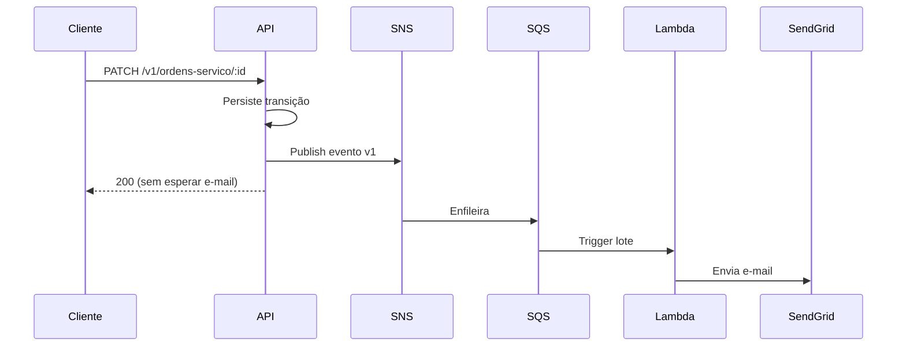

# Notificações assíncronas de status

## Fluxo

```text
API (SNS publish) → SNS → SQS → Lambda notificacao → SendGrid
                                      ↓ (após maxReceiveCount)
                                     DLQ
```

A mudança de status da OS é persistida **antes** da publicação do evento. Falha no envio de e-mail não reverte a transação de negócio.

## Contrato do evento

Ver também `tech-challenge-serverless/docs/contrato-evento-notificacao.md`.

- Tipo: `ordem-servico.status-changed.v1`
- Campos principais: `eventId`, `correlationId`, `ordemServicoId`, `statusAnterior`, `statusNovo`, `destinatario`
- Sem token, CPF ou segredos no payload

## Configuração local

| Variável | Padrão | Descrição |
| --- | --- | --- |
| `NOTIFICACAO_TRANSPORT` | `local` | `local` (log), `sns` (produção) ou `sendgrid` (legado) |
| `SNS_NOTIFICACAO_TOPIC_ARN` | — | ARN do tópico SNS (obrigatório com `sns`) |
| `AWS_REGION` | `us-east-1` | Região AWS |

## Produção (EKS)

- ServiceAccount `oficina-api` com IRSA (`sns:Publish` no tópico dedicado).
- SendGrid fica apenas na Lambda (`SENDGRID_SECRET_ARN` no Secrets Manager).
- `correlationId` da requisição HTTP é propagado até os logs da Lambda.

## Observabilidade

Alarmes CloudWatch (repo infra-kubernetes):

- idade e backlog da fila SQS
- mensagens na DLQ
- erros e throttles da Lambda

## DLQ — consulta e reprocessamento

1. Liste mensagens: `aws sqs receive-message --queue-url <dlq-url> --max-number-of-messages 10`
2. Inspecione o corpo (`Message` SNS) e valide o schema v1.
3. Corrija a causa (secret SendGrid, e-mail inválido, bug de schema).
4. Reenvie **manualmente** para a fila principal somente mensagens corrigidas.
5. **Não** reencaminhe payloads permanentemente inválidos — evita loop infinito.
6. Se a OS precisar ser avisada novamente, prefira uma nova transição legítima ou republicação consciente com novo `eventId`.

## Diagrama de sequência


